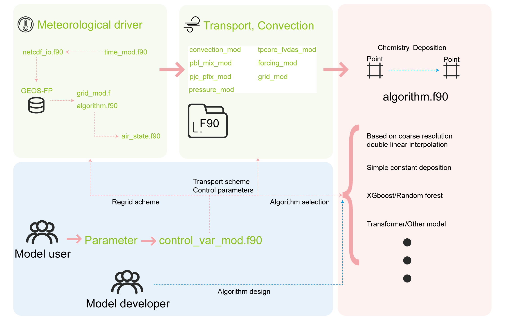

## Project Description

This project focuses on developing a global high-resolution framework tailored for the GEOS-Chem Adjoint model. The initial version has been completed, and the second-generation framework is currently under development. The present framework employs a hybrid-process approach to achieve global high-resolution simulations of primary particulate matter. However, it still faces challenges in accurately simulating substances with high chemical reactivity that depend heavily on pollutant concentrations. To address these limitations, we are incorporating machine learning techniques into the modeling of various processes. We welcome you to follow our progress and support the project by starring it for updates on our latest advancements.

## Code structure

You can easily utilize our project as an algorithmic framework, providing global high-resolution, data-driven capabilities. The overall structure of the code is outlined as follows:

## Result Presentation

